# Centralized Secret Management System using AWS Secrets Manager

## 📌 Project Overview

This project demonstrates how to securely manage database credentials in a cloud environment by eliminating hardcoded secrets and implementing centralized secret storage using AWS services.

Initially, the application uses hardcoded database credentials (insecure approach). Later, it is enhanced to securely fetch credentials dynamically from AWS Secrets Manager using IAM roles and SDK integration, along with automatic secret rotation.

---

## 🎯 Objectives

* Eliminate hardcoded credentials from application code
* Implement centralized secret storage using AWS Secrets Manager
* Control access using IAM roles (no access keys)
* Enable automatic secret rotation using AWS Lambda
* Ensure application works seamlessly after credential rotation

---

## 🏗️ Architecture Overview

* **EC2** → Hosts Flask application
* **RDS (MySQL)** → Database service
* **Secrets Manager** → Stores DB credentials securely
* **IAM Role** → Grants EC2 access to secrets
* **Lambda** → Handles automatic secret rotation

---

## ⚙️ Technologies Used

* AWS EC2
* AWS RDS (MySQL)
* AWS Secrets Manager
* AWS IAM
* AWS Lambda
* Python (Flask, boto3, pymysql)

---

# 🚀 Implementation Steps

---

## 🔹 Step 1: RDS Setup (Database Creation)

1. Go to AWS Console → RDS → Create database
2. Select:

   * Engine: MySQL
   * Template: Free tier
3. Configure:

   * DB name: `mydb`
   * Username: `admin`
   * Password: `Temppass123`
4. Enable **Public Access (for testing)**
5. Create database

    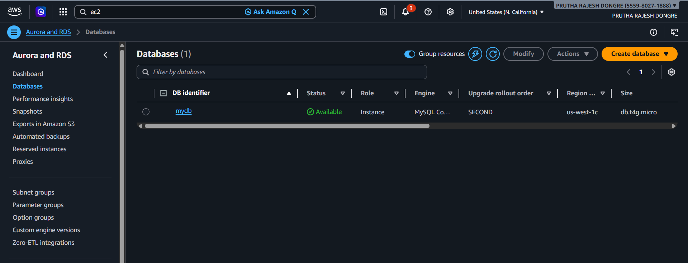

###  Security Group Configuration

* Allow inbound rule:

  * MySQL (3306)
  * HTTP (80)
  * SSH (22)
  * Python (5000)

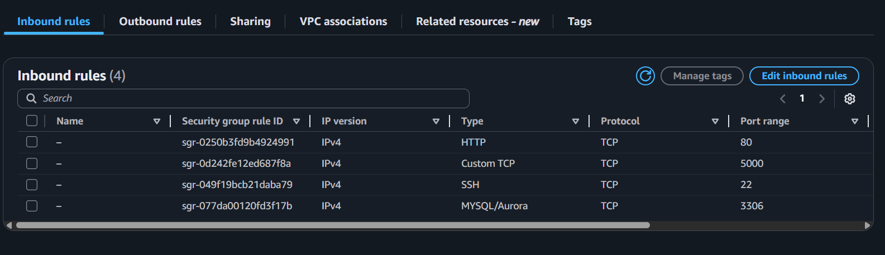

---

## 🔹 Step 2: Launch EC2 and Connect to RDS & Create Table

1. Launch EC2 instance (Ubuntu)
    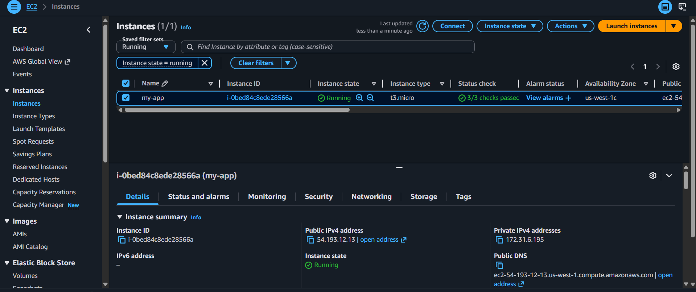

2. Connect from EC2:

```bash
mysql -h <RDS-ENDPOINT> -u admin -p
```

Run:

```sql
CREATE DATABASE mydb;
USE mydb;

CREATE TABLE users (
    id INT AUTO_INCREMENT PRIMARY KEY,
    name VARCHAR(100)
);
```

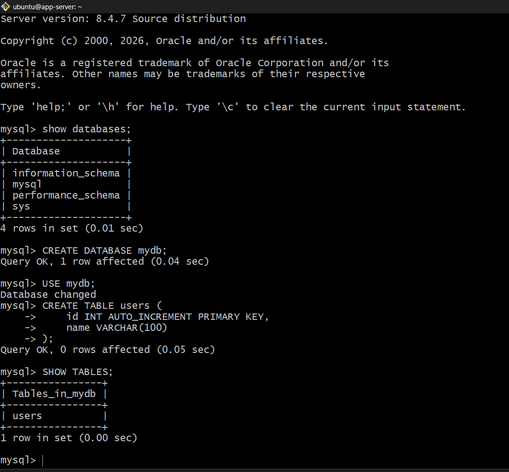

---

## 🔹 Step 3: EC2 Setup & Application Deployment

1. Install dependencies:

```bash
sudo apt update
sudo apt install python3-pip python3-venv mysql-client -y
```

3. Create virtual environment:

```bash
python3 -m venv myenv
source myenv/bin/activate
```

4. Install Python libraries:

```bash
pip install flask pymysql boto3
```

---

## 🔹 Step 4: Insecure Application (Hardcoded Credentials ❌)

A Flask application is created with hardcoded database credentials.


## app.py (hardcoded)
```
from flask import Flask, request
import pymysql

app = Flask(__name__)

# HARDCODED CREDENTIALS (INSECURE - for demo)
DB_HOST = "mydb.cb8uumumcjj4.us-west-1.rds.amazonaws.com"
DB_USER = "admin"
DB_PASS = "TempPass123"
DB_NAME = "mydb"

def connect_db():
    return pymysql.connect(
        host=DB_HOST,
        user=DB_USER,
        password=DB_PASS,
        database=DB_NAME
    )

@app.route('/')
def home():
    return '''
    <h2>Enter Name</h2>
    <form action="/add" method="post">
        <input type="text" name="username" required>
        <input type="submit" value="Submit">
    </form>
    '''

@app.route('/add', methods=['POST'])
def add_user():
    name = request.form['username']

    conn = connect_db()
    cursor = conn.cursor()

    cursor.execute("INSERT INTO users (name) VALUES (%s)", (name,))
    conn.commit()

    cursor.execute("SELECT * FROM users")
    users = cursor.fetchall()

    conn.close()

    output = "<h2>Users in DB:</h2>"
    for user in users:
        output += f"<p>{user}</p>"

    return output

if __name__ == '__main__':
    app.run(host='0.0.0.0', port=5000)
```

### Features:

* Web form to input user name
* Stores data in RDS
* Displays stored records

### Run Application:

```bash
python app.py
```

Access:

```
http://<EC2-IP>:5000
```

👉 This demonstrates the **security risk of hardcoded credentials**

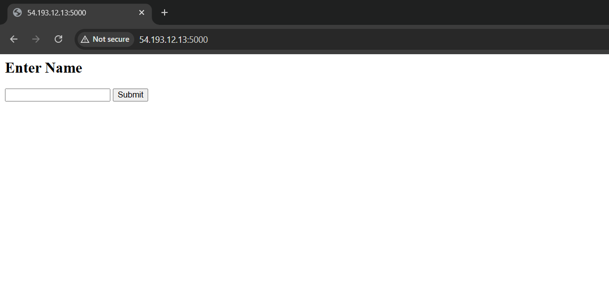
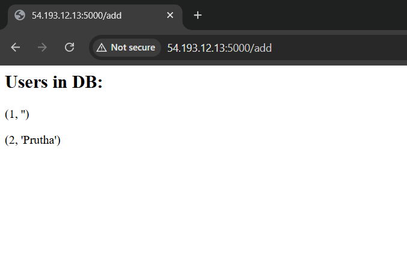

---

## 🔹 Step 5: Store Credentials in AWS Secrets Manager

1. Go to AWS Secrets Manager
2. Click **Store a new secret**
3. Choose:

   * Credentials for RDS database
4. Enter:

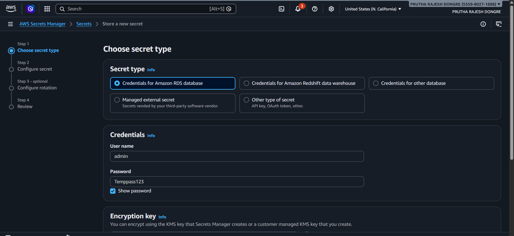
- username: "admin"
- password: "Temppass123"

5. Select RDS
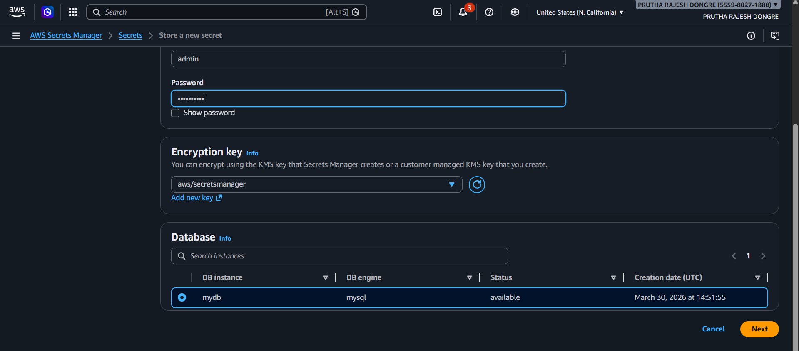


6. Secret name:

    ```
    mydb_secret
    ```

7. Enable Automatic Rotation 

    * Enable **Automatic rotation**
    * Use default Lambda function
    * Select rotation interval (e.g., 4 hour)

    AWS creates a Lambda function automatically to:

    * Rotate DB password
    * Update RDS
    * Update secret

    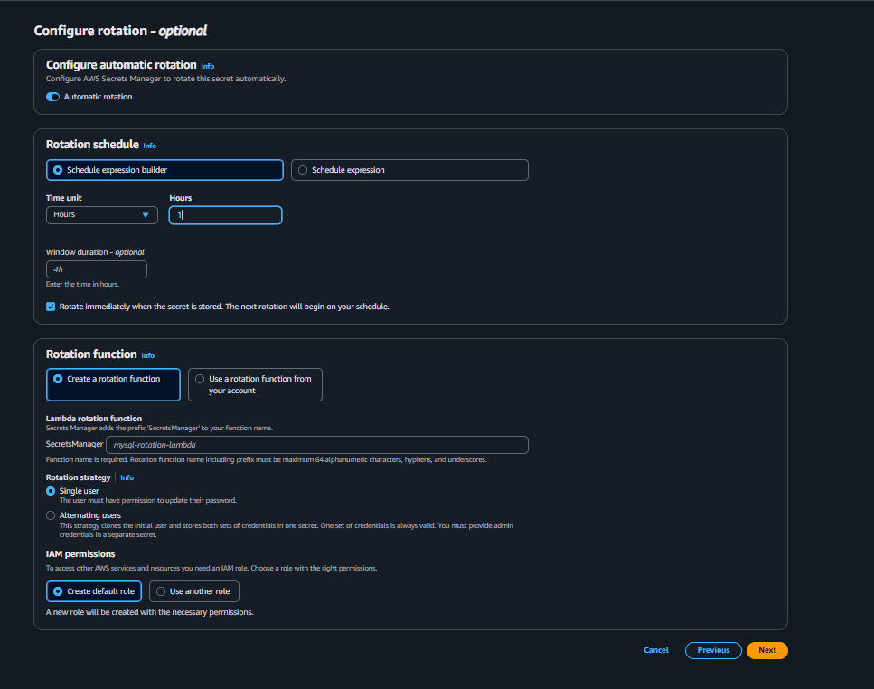

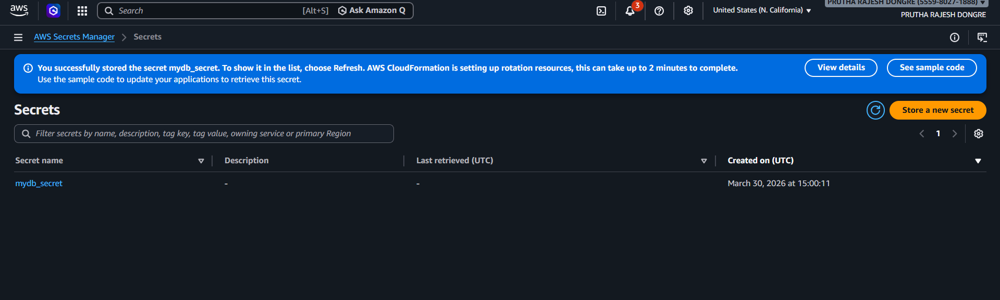

---

## 🔹 Step 6: IAM Role Configuration

1. Go to IAM → Create Role
2. Trusted entity → EC2
3. Attach policy:

   * `SecretsManagerReadWrite`
   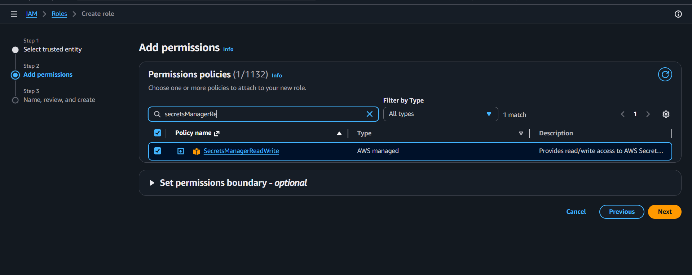

4. Name role:

    ```
    EC2-SecretsManager-Role
    ```

5. Attach role to EC2 instance
    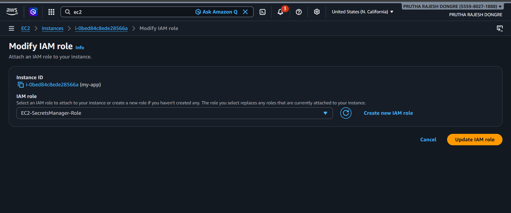

This removes need for access keys

---

## 🔹 Step 7: Secure Application (Using SDK)

Modify application to fetch secrets using **boto3 SDK**:

### Secure app.py
```
from flask import Flask, request
import pymysql
import boto3
import json

app = Flask(__name__)

# Fetch secret from AWS Secrets Manager
def get_secret():
    client = boto3.client("secretsmanager", region_name="us-west-1")

    response = client.get_secret_value(
        SecretId="rds-db-secret"
    )

    secret = json.loads(response["SecretString"])
    return secret


#  Connect to DB using secret
def connect_db():
    creds = get_secret()

    return pymysql.connect(
        host=creds["host"],
        user=creds["username"],
        password=creds["password"],
        database=creds["dbname"]
    )


@app.route('/')
def home():
    return '''
    <h2>Enter Name</h2>
    <form action="/add" method="post">
        <input type="text" name="username" required>
        <input type="submit" value="Submit">
    </form>
    '''


@app.route('/add', methods=['POST'])
def add_user():
    name = request.form['username']

    # optional validation
    if not name.strip():
        return "Name cannot be empty"

    conn = connect_db()
    cursor = conn.cursor()

    cursor.execute("INSERT INTO users (name) VALUES (%s)", (name,))
    conn.commit()

    cursor.execute("SELECT * FROM users")
    users = cursor.fetchall()

    conn.close()

    output = "<h2>Users in DB:</h2>"
    for user in users:
        output += f"<p>{user}</p>"

    return output


if __name__ == '__main__':
    app.run(host='0.0.0.0', port=5000)
```

### Key Improvements:

* No credentials in code
* Secrets fetched dynamically
* IAM-based authentication

---

## 🔹 Step 8: Test Secure Application

* Run app
* Insert data
* Verify DB entries

    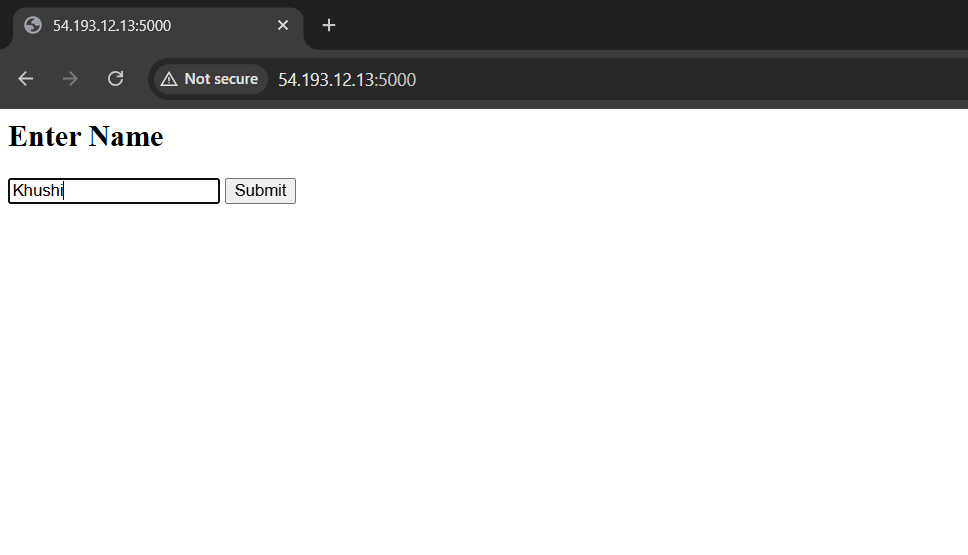
    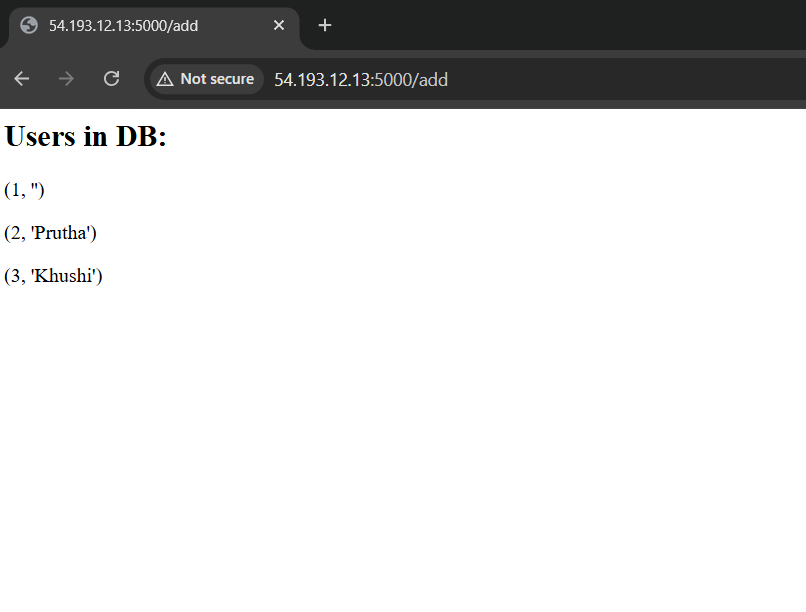

Application works without hardcoded credentials

---

## 🔹 Step 10: Test Secret Rotation (Final Validation)

1. Go to Secrets Manager
2. Click:

   * **Rotate secret immediately**
3. Wait for completion
   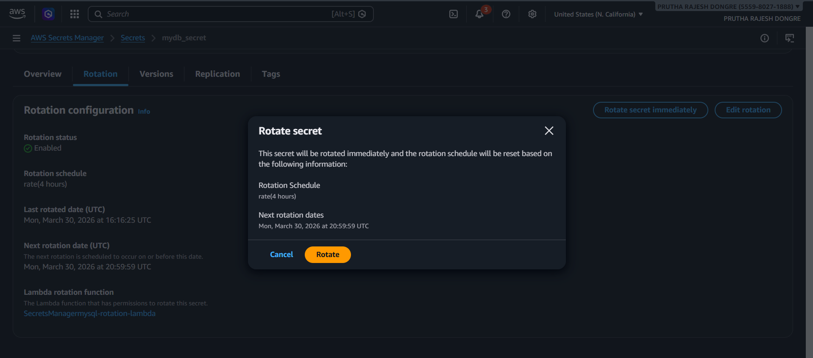

### Verify:

* Password updated in Secret
    - Before 
        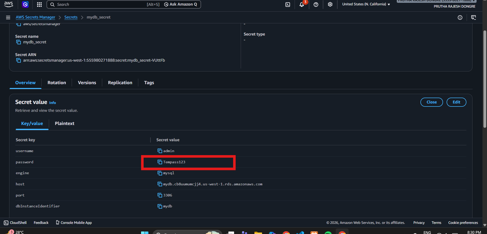
    - After
        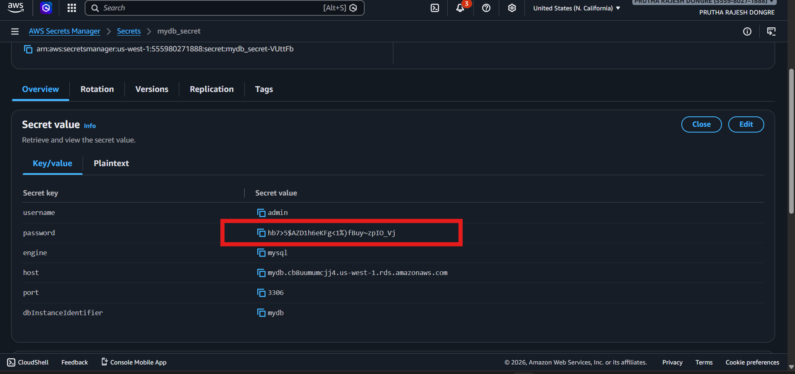

* Application still works
  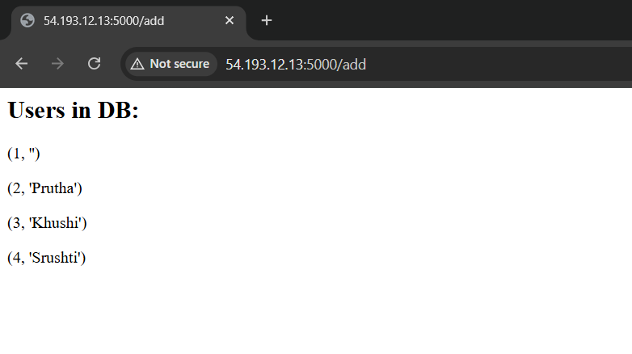
  
* Connect to RDS and Check the Data
  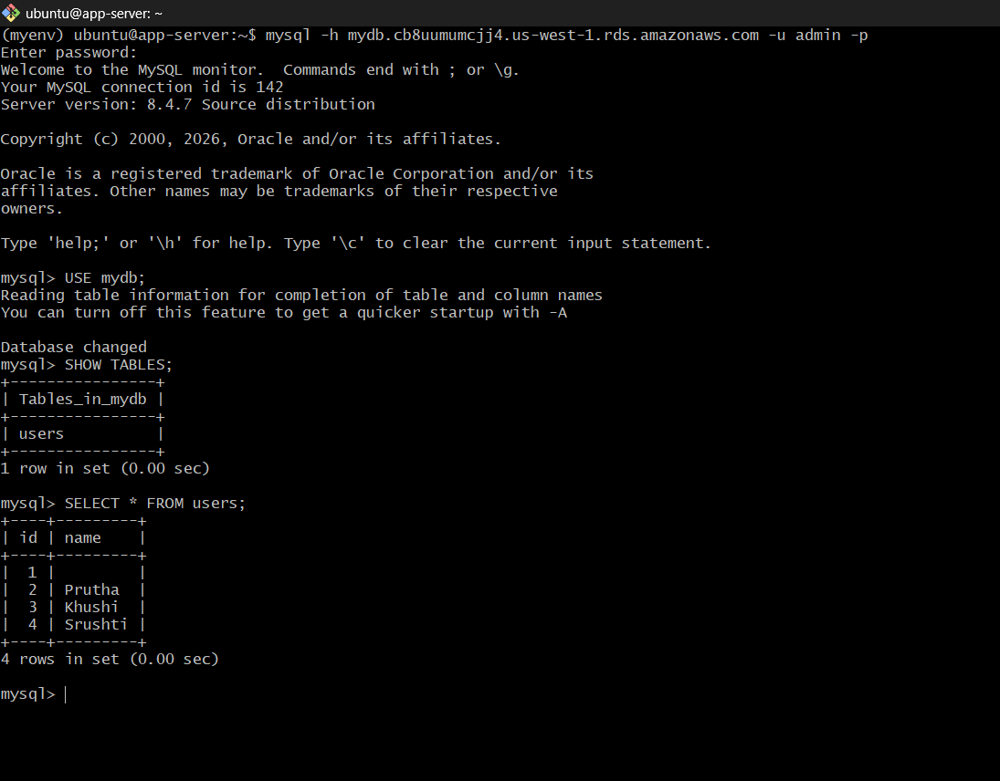

This proves:
- ✔ Dynamic secret retrieval
- ✔ Zero downtime
- ✔ Secure architecture

---

### Security Validation
✔ No Access Keys Configured on Server

To ensure secure access, the EC2 instance was configured to use an IAM role instead of static AWS credentials.
- Checked AWS CLI configuration:
    ```
    aws configure list
    ```
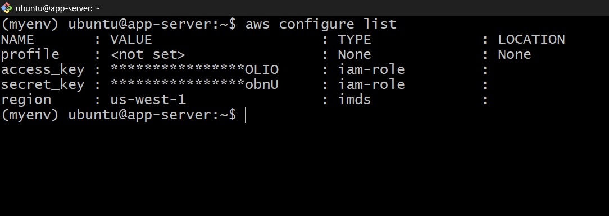

Interpretation
- Credentials are sourced from IAM Role
- No static access keys are configured
- AWS uses temporary credentials via Instance Metadata Service (IMDS)

Conclusion
<br>The application securely accesses AWS services using IAM role-based authentication without storing any access keys on the server, following AWS security best practices.


---

# Why Secret Rotation Matters

* Prevents long-term credential exposure
* Reduces risk of security breaches
* Ensures compliance with best practices
* Automates credential lifecycle

---

#  Security Improvements

| Before ❌              | After ✅           |
| --------------------- | ----------------- |
| Hardcoded credentials | Secrets Manager   |
| Exposed passwords     | Encrypted secrets |
| Static credentials    | Auto-rotated      |
| Access keys required  | IAM roles         |
| Manual updates        | Automated         |

---

# Final Outcome

* Successfully implemented centralized secret management
* Eliminated hardcoded credentials
* Enabled secure IAM-based access
* Achieved zero-downtime secret rotation
* Built a production-level DevSecOps solution

---

# Key Learnings

* Importance of secure secret management
* IAM role-based access control
* SDK integration using boto3
* Automatic credential rotation
* Real-world DevSecOps practices

---
